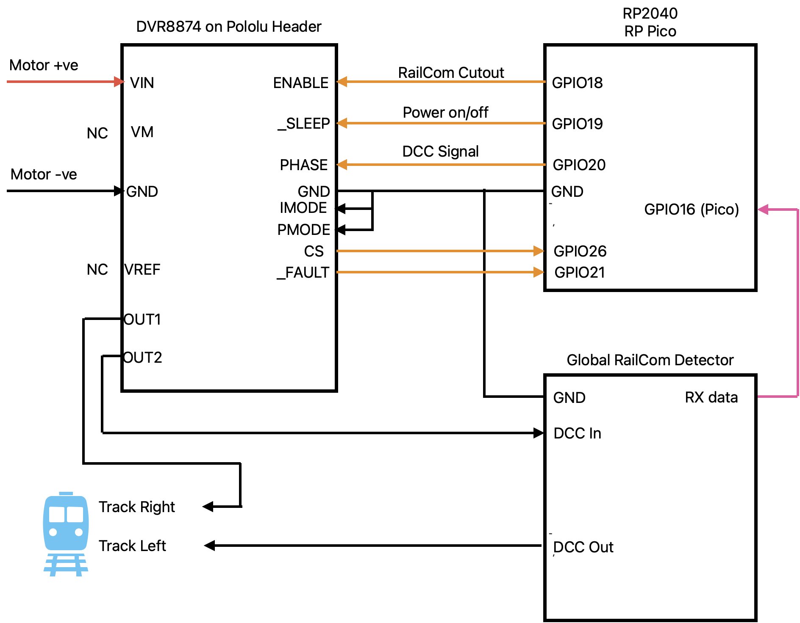

# Hardware and Environment

The primary target Micro Controller Units for this project are Raspberry Pi RP2
based and run MicroPython V1.26 or later. Testing has principly taken place on
Pico, Pico W, Pico 2W and Arduino Nano RP2040 Connect platforms.
DCC and RailCom components use the RP2 Programmable IO peripheral so must be run
on an RP2040 or RP2350 based MCU.
Other application components
may run on other MicroPython capabable platforms with no, or minor modifications.

Primary components are:

- a command station with integrated booster/RailCom cutout and global RailCom detector
- a local RailCom detector module with up to four detectors and current based occupancy detection.

A booster is required to convert the DCC signal into a form suitable for
suppling power directly to track. The reference booster is the Texas
Instruments DRV8874 mounted on a Pololu header. This also acts as the RailCom cutout. This may deliver up to 2.9 A
instantaniously but is only rated for 2.1 A continuous load. You will also
need a suitable DC power supply.

RailCom detectors have been specifically designed for this project with circuit
schematics and PCB designs for both command station and local detectors. The PCB designs
and applications have been designed around a standard set of GPIO pin
allocations. The local RailCom detector also provides a block occupancy indication using
conventional current flow detection. This triggers at a nominal 1 mA enabling detection
of 10 kΩ wheel set resistors.
SPI1 and other GPIO pins not currently used by the application suite
may be exposed PCB on headers.

## GPIO Pins, I2C & SPI

### Command Station

On the command station one global detector is
available for the receipt of Channel 2 datagrams. Pin allocations for a Pico based command station are as follows.

|GPIO Pin (Pico & Nano)|Function|
|---|---|
|4|OLED I2C0:sda|
|5|OLED I2C0:scl|
|16|RailCom Ch 2 rx|
|18|DRV8874 EN|
|19|DRV8874 nSleep|
|20|DRV8874 PH|
|21|DRV8874 nFault|
|22|NeoPixel chain (2 LEDs)|
|26|DRV8874 Current Sense|
|Ground|DRV8874 iMode|
|Ground|DRV8874 pMode|
|NC|DRV8874 Vref|

### Quad Local Detector

The following table shows pin allocations for a four block local detector on a Pico series
platform. Pin allocations on other platforms may differ. Other platforms may be able to
support additional local detectors.

I2C0, I2C1 and SPI1 pin assignments follow the MicroPython default pin assignments for
these peripherals.

SPI1 may be wired to a PCB header for off board connection.

I2C1 is used to support conventional current based detector functions.
It may be wired to a PCB header for off board connection too.

|GPIO Pin|Pico / Pico W|
|---|---|
|4|OLED I2C0:sda|
|5|OLED I2C0:scl|
|6|I2C1:sda|
|7|I2C1:scl|
|8|SPI1 MISO|
|9|SPI1 CS(primary)|
|10|SPI1 SCK|
|11|SPI1 MOSI|
|12|SPI1 additional GPIO (e.g. interrupt)|
|13|SPI1 CS(alternative)|
|14|RailCom ch 1 (a) rx|
|15|RailCom ch 1 (a) orientation|
|16|RailCom ch 1 (b) rx|
|17|RailCom ch 1 (b) orientation|
|18|RailCom ch 1 (c) rx|
|19|RailCom ch 1 (c) orientation|
|20|RailCom ch 1 (d) rx|
|21|RailCom ch 1 (d) orientation|
|22|NeoPixel chain (5 LEDs)|
|26|User press button|
|27|RailCom cutout detect|

## Programmable Input/Output & State Machines

The DCC and RailCom components make extensive use of the RP2 Programmable
Input/Output (PIO) peripherals. Each PIO peripheral has four State Machines. The RP2040 has
2 PIO peripherals and the RP2350 has 3.
MicroPython numbers
the State Machines on these as 0 to 7 and 0 to 11 respectively.

The command station uses a PIO state machine for DCC signal generation and timing the
cutout. Each RailCom detector uses two PIO state machines - one to time the Channel 1 or
Channel 2 window as appropriate and one to de-serialise the RailCom message.

On the Pico W and Pico2 W use of the radio module also requires use of a PIO
State Machine and a State Machine may also be used to drive a NeoPixel chain.

Note that the tables show the default radio state
machines as grabbed if available by the MicroPython
Wi-Fi module/RP SDK library.
The DCC & RailCom MicroPython application code leaves these
free for the radio rather than specifically
allocating them.

### Command Station State Machines

|State Machine|Function|
|---|---|
|0|DCC generation|
|1 - 3|Not available. DCC generation uses virtually all PIO 0 memory|
|4|Radio on Pico W|
|5|NeoPixel on Pico / Pico W|
|6|RailCom Channel 2 timing|
|7|RailCom Channel 2 RX|
|8|Radio on Pico2 W|
|9|NeoPixel on Pico2 / Pico2 W|

### Quad Local Detector State Machines

|State Machine|Function|
|---|---|
|0|Block A RailCom Channel 1 timing|
|1|Block A RailCom RX|
|2|Block B RailCom Channel 1 timing|
|3|Block B RailCom RX|
|4|Block C RailCom Channel 1 timing|
|5|Block C RailCom RX|
|6|Block D RailCom Channel 1 timing|
|7|Block D RailCom RX|
|8|Radio on Pico2 W|
|9|NeoPixel on Pico2 / Pico2 W|
